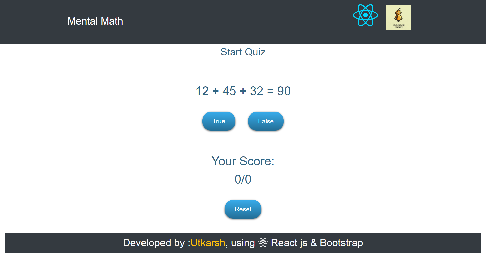

# Mental-Math ⚡️ 
<p align="center"> 
  <kbd>
</img>
  </kbd>
</p>

## A clean, beautiful and responsive react-application for your mental math ability.! 

<p align="center"> 
  <kbd>
</img>
  </kbd>
</p>


## Build with 🔧
 * React  -Front-end frame work to develop one page applications.
 * Bootstrap  -Contains predefined classes to create responsive websites.

## Run the project in your set up
Before you need to run application in your enviroment you need to install npm and node

```bash
git clone https://github.com/utkarsh1810/Mental-Math.git
cd Mental-Math

npm install
```
To run the application

```bash
npm start
```
## Deployment 📦 
Application is deploy with the help of free open source platform netlify
* Again you can check it [here](https://gifted-panini-6a6e9c.netlify.app/)

## Contributors ✨
The entire application has just been developed by itself<br/>
But any new suggestion and contributions are always appreciated.

## License 📄

This project is licensed under the GPL-3.0 License - see the [LICENSE](./LICENSE) file for details
 


